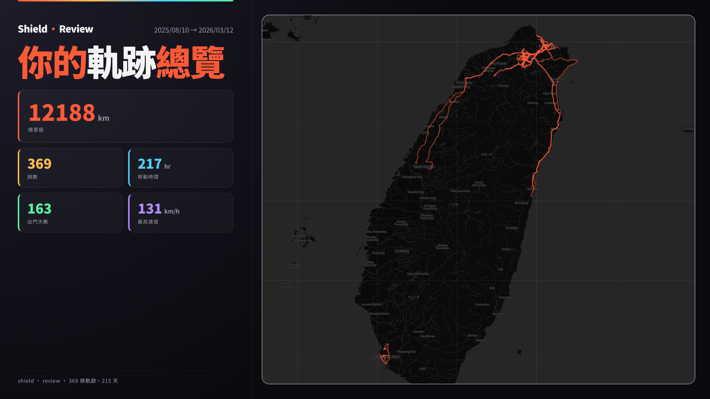
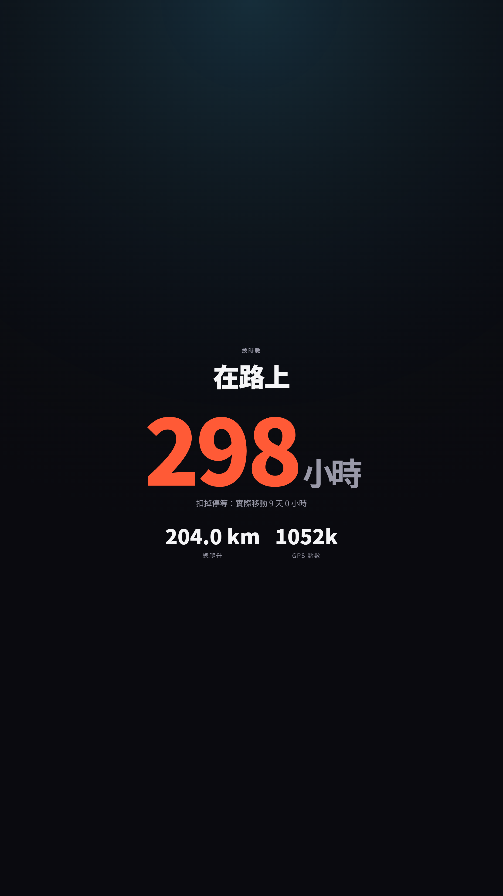
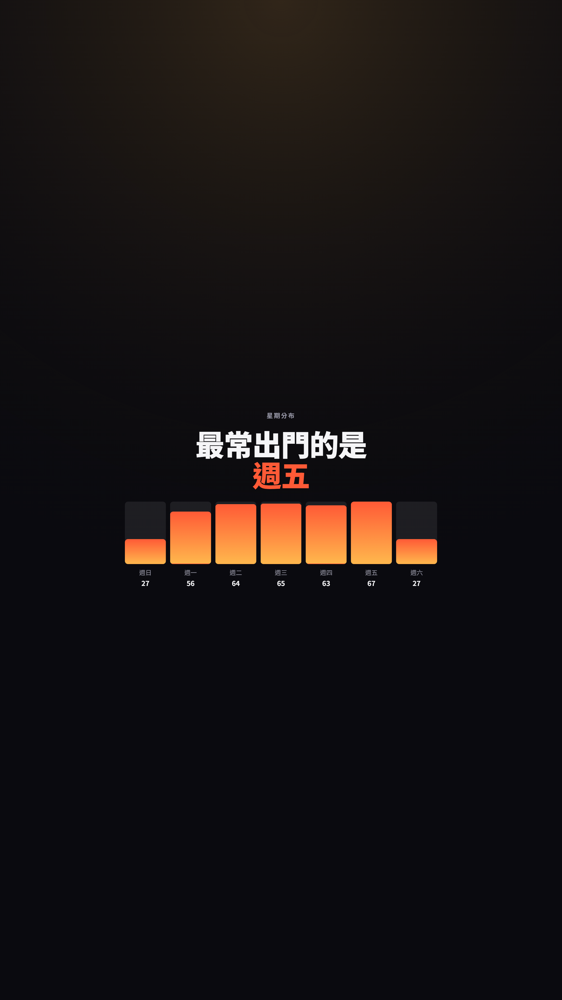
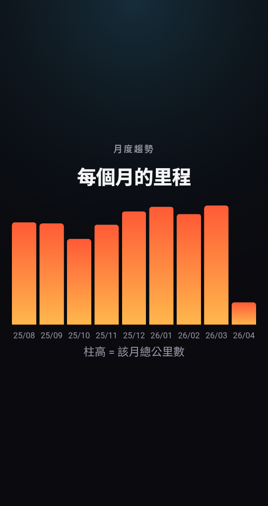
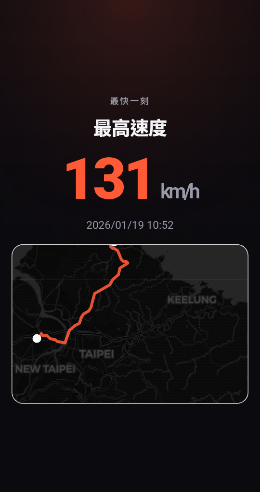
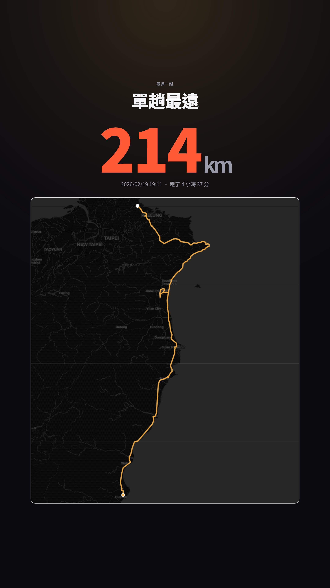
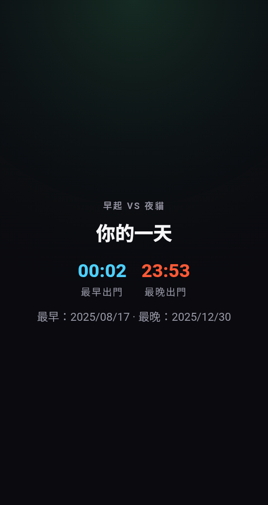

# Shield Review

> 緣起：看到手機匯出的神盾的紀錄，想起原本想搞這個，謹此

把 神盾測速照相 匯出的 GPX 軌跡壓縮檔變成一份卡片式的回顧。
**純前端、純靜態、零伺服器** — 紀錄只留在本地瀏覽器。

[Try it !](https://jung217.github.io/shield_review/)

## 預覽

> 地圖總覽海報：

<p align="center">
  
</p>

> 卡片回顧：

<p align="center">
  
  
  
  
  
  
  
  
  
  
</p>

## 它能做什麼

把 `share_track_*.zip` 丟進去之後：

- **回顧頁**（大字卡片、滑動切換）：總公里、總時數、趟數、熱門時段／星期、月度趨勢、最快速度、最長一趟、最早 / 最晚出門，每張都能存成圖片
- **地圖頁**：所有軌跡疊圖、線路 / 熱力切換、點軌跡看細節、整份總覽存成海報
- **本機解析**：JSZip + DOMParser 都在瀏覽器跑，IndexedDB 緩存

## 在你的電腦測

```sh
cd docs
python3 -m http.server 8765
```

> 開 [http://localhost:8765](http://localhost:8765)，按「載入示範資料」就會跑 demo（19.5 MB 的 zip，內含 369 條軌跡）。


## 專案結構

```
docs/
├── index.html        上傳頁
├── dashboard.html    大字卡片回顧
├── map.html          Leaflet 地圖
├── demo.zip          示範資料（369 條軌跡）
├── favicon.svg       網頁 icon
├── css/style.css
└── js/
    ├── app.js          上傳 → 解析 → 緩存 → 跳轉
    ├── gpx-parser.js   GPX → track + 計算總計
    ├── zip-loader.js   JSZip 包裝
    ├── stats.js        回顧用的全部統計
    ├── storage.js      IndexedDB 緩存
    ├── dashboard.js    渲染回顧卡片
    └── map.js          渲染地圖
```

## Library（CDN）

- [JSZip](https://stuk.github.io/jszip/) — 解 zip
- [Leaflet](https://leafletjs.com/) + [Leaflet.heat](https://github.com/Leaflet/Leaflet.heat) — 地圖跟熱力
- [html2canvas](https://html2canvas.hertzen.com/) — 卡片 / 海報存圖
- 地圖底圖：[CARTO Dark](https://carto.com/attributions)（OSM）

## 隱私

整份檔案不離開本地瀏覽器，所有解析、計算、暫存（IndexedDB）都在你的裝置上。
